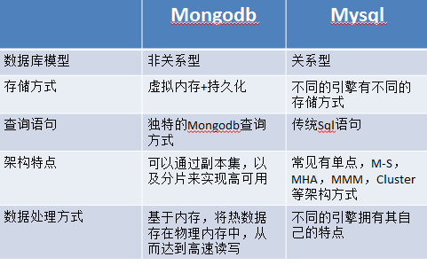
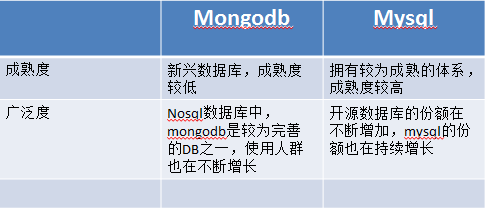

# MongoDB
Mongo Basic knowledge

## MongoDB

   概览

   * mongo是一个高可用、分布式、无模式的文档数据库。
   * mongo和传统关系数据库的最本质的区别在那里呢？就是其文档模型。
   * 如何考虑MongoDB 文档模式设计的基本策略呢？一般建议的是先考虑内嵌，但是有一些时候，使用引用则难以避免。
   * MongoDB是为应用程序设计的，而不是为了存储优化的。如果可以达到最高性能的话，我们甚至可以做一些反范式的东西。
   
   MonngoDB介绍
   
   * MongoDB (名称来自"humongous") 是一个可扩展的高性能，开源，模式自由，面向文档的数据库。它使用C++编写。MongoDB特点:
   
        + 面向集合的存储：适合存储对象及JSON形式的数据。
   
        + 动态查询：mongo支持丰富的查询表达方式，查询指令使用JSON形式的标记，可轻易查询文档中的内嵌的对象及数组。
   
        + 完整的索引支持:包括文档内嵌对象及数组。mongo的查询优化器会分析查询表达式，并生成一个高效的查询计划。
   
        + 查询监视：mongo包含一个监视工具用于分析数据库操作性能。
   
        + 复制及自动故障转移：mongo数据库支持服务器之间的数据复制，支持主-从模式及服务器之间的相互复制。复制的主要目的是提供冗余及自动故障转移。
   
        + 高效的传统存储方式：支持二进制数据及大型对象（如照片或图片）。
   
        + 自动分片以支持云级别的伸缩性：自动分片功能支持水平的数据库集群，可动态添加额外的机器。
   
   MongoDB的特性

   1. 简单的查询语句，没有Join操作
   2. 文档型存储，其数据是用二进制的Json格式Bson存储的。其数据就像Ruby的hashes，或者Python的字典，或者PHP的数组
   3. Sharding，MongoDB提供auto-sharding实现数据的扩展性
   4. GridFS，MongoDB的提供的文件存储API
   5. 数组索引，你可以对文档中的某个数组属性建立索引
   6. MapReduce，可以用于进行复杂的统计和并行计算
   7. 高性能，通过使用mmap和定时fsync的方法，避免了频繁IO，使其性能更高

   MongoDB的优点

   1. 高性能，速度非常快（如果你的内存足够的话）
   2. 没有固定的表结构，不用为了修改表结构而进行数据迁移
   3. 查询语言简单，容易上手
   4. 使用Sharding实现水平扩展
   5. 部署方便

   使用MongoDB，你得记住以下几点：

   1. MongoDB 假设你有大磁盘空间
   2. MongoDB 假设你的内存也足够大于放下你的热数据
   3. MongoDB 假设你是部署在64位系统上的（32位有2G的限制，试用还可以）
   4. MongoDB 假设你的系统是little-endian的
   5. MongoDB 假设你有多台机器（并不专注于单机可靠性）
   6. MongoDB 假设你希望用安全换性能，同时允许你用性能换安全

   MongoDB在下面领域不太擅长

   1. 不太稳定，特别是auto-sharding目前还有很多问题
   2. 不支持SQL，这意味着你很多通过SQL接口的工具不再适用
   3. 持久化，MongoDB单机可靠性不太好，宕机可能丢失一段时间的数据

   注意：

   1. 默认情况下，MongoDB 的每个数据库的命名空间保存在一个 16MB 的 .ns 文件中，平均每个命名占用约 628 字节，也即整个数据库的命名空间的上限约为 24000。
   2. 每一个集合、索引都将占用一个命名空间。所以，如果每个集合有一个索引（比如默认的 _id 索引），那么最多可以创建 12000 个集合。
   3. 如果索引数更多，则可创建的集合数就更少了。同时，如果集合数太多，一些操作也会变慢。不过，如果真的需要建立更多的集合的话，MongoDB 也是支持的，只需要在启动时加上“--nssize”参数，这样对应数据库的命名空间文件就可以变得更大以便保存更多的命名。这个命名空间文件（.ns 文件）最大可以为 2G，也就是说最大可以支持约 340 万个命名，如果每个集合有一个索引的话，最多可创建约 170 万个集合。
   4. 还需要注意，--nssize 只设置新创建的 .ns 文件的大小，如果想改变已经存在的数据库的命名空间，在使用这个参数启动后，还需要运行 db.repairDatabase() 命令来调整尺寸。

## MongoDB 与 Noql 和 关系型数据库异同
   当前主流的关系型数据库有Oracle、DB2、Microsoft SQL Server、Microsoft Access、MySQL等。

   非关系型数据库有 NoSql、Cloudant。
   
   典型的NoSQL数据库:
   
   * 临时性键值存储（memcached、Redis）、永久性键值存储（ROMA、Redis）、面向文档的数据库（MongoDB、CouchDB）、面向列的数据库（Cassandra、HBase）
   
   一、 键值存储
   ````
   SQL：对于SQL来说，也是我们最常说的关系型数据库，比如：MySQL，SQLServer等。那么，它的一个最明显的表示是，它的数据，全部是通过表单进行存储，有行和列之分。
   
   NoSQL：相对于SQL而言，NoSQL则是一种非关系型的数据库。NoSQL（not only SQL），它的数据存储是以文档或者集合的形式进行，没有行列之分。
   ````
   1. 实质。
   非关系型数据库的实质：非关系型数据库产品是传统关系型数据库的功能阉割版本，通过减少用不到或很少用的功能，来大幅度提高产品性能。
   
   2. 价格。
   目前基本上大部分主流的非关系型数据库都是免费的。而比较有名气的关系型数据库，比如Oracle、DB2、MSSQL是收费的。虽然Mysql免费，但它需要做很多工作才能正式用于生产。
   
   3. 功能。
   实际开发中，有很多业务需求，其实并不需要完整的关系型数据库功能，非关系型数据库的功能就足够使用了。这种情况下，使用性能更高、成本更低的非关系型数据库当然是更明智的选择。
   
   **非关系型数据库的优势：**
   ````
   1. 性能
   NOSQL是基于键值对的，可以想象成表中的主键和值的对应关系，而且不需要经过SQL层的解析，所以性能非常高。
   2. 可扩展性
   同样也是因为基于键值对，数据之间没有耦合性，所以非常容易水平扩展。
   ````
   **关系型数据库的优势：**
   ````
   1. 复杂查询
   可以用SQL语句方便的在一个表以及多个表之间做非常复杂的数据查询。
   2. 事务支持
   使得对于安全性能很高的数据访问要求得以实现。
   ````
   * NOSQL数据库慢慢开始具备SQL数据库的一些复杂查询功能的雏形，比如Couchbase的index以及MONGO的复杂查询。对于事务的支持也可以用一些系统级的原子操作来实现例如乐观锁之类的方法来曲线救国。
   
   * SQL数据库也开始慢慢进化，比如HandlerSocker技术的实现，可以在MYSQL上实现对于SQL层的穿透，用NOSQL的方式访问数据库，性能可以上可以达到甚至超越NOSQL数据库。可扩展性上例如Percona Server，可以实现无中心化的集群。
   
   虽然这两极都因为各自的弱势而开始进化出另一极的一些特性，但是这些特性的增加也会消弱其本来具备的优势，比如Couchbase上的index的增加会逐步降低数据库的读写性能。
   
   以MongoDB与MySQL为例：
   
   
   
   
   
   

   
   
## MongoDB 与 Redis、memCashed、CouchDB、ufile、ufs等区别

   临时性键值存储（memcached、Redis）、永久性键值存储（ROMA、Redis）、面向文档的数据库（MongoDB、CouchDB）、面向列的数据库（Cassandra、HBase）
   * 键值存储
   
        它的数据是以键值的形式存储的，虽然它的速度非常快，但基本上只能通过键的完全一致查询获取数据，根据数据的保存方式可以分为临时性、永久性和两者兼具 三种。
   
        1. 临时性
        
             所谓临时性就是数据有可能丢失，memcached把所有数据都保存在内存中，这样保存和读取的速度非常快，但是当memcached停止时，数据就不存在了。由于数据保存在内存中，所以无法操作超出内存容量的数据，旧数据会丢失。总结来说：
        
             - 在内存中保存数据
        
             - 可以进行非常快速的保存和读取处理
        
             - 数据有可能丢失
        2. 永久性
        
              所谓永久性就是数据不会丢失，这里的键值存储是把数据保存在硬盘上，与临时性比起来，由于必然要发生对硬盘的IO操作，所以性能上还是有差距的，但数据不会丢失是它最大的优势。总结来说：
        
              - 在硬盘上保存数据
        
              - 可以进行非常快速的保存和读取处理（但无法与memcached相比）
        
              - 数据不会丢失
        3. 两者兼备
        
              Redis属于这种类型。Redis有些特殊，临时性和永久性兼具。Redis首先把数据保存在内存中，在满足特定条件（默认是 15分钟一次以上，5分钟内10个以上，1分钟内10000个以上的键发生变更）的时候将数据写入到硬盘中，这样既确保了内存中数据的处理速度，又可以通过写入硬盘来保证数据的永久性，这种类型的数据库特别适合处理数组类型的数据。总结来说：
        
              - 同时在内存和硬盘上保存数据
        
              - 可以进行非常快速的保存和读取处理
        
              - 保存在硬盘上的数据不会消失（可以恢复）
        
              - 适合于处理数组类型的数据
   * 面向文档的数据库
   
        MongoDB、CouchDB属于这种类型，它们属于NoSQL数据库，但与键值存储相异。
   
        1. 不定义表结构
            + 即使不定义表结构，也可以像定义了表结构一样使用，还省去了变更表结构的麻烦。
      
        2. 可以使用复杂的查询条件 
            - 跟键值存储不同的是，面向文档的数据库可以通过复杂的查询条件来获取数据，虽然不具备事务处理和Join这些关系型数据库所具有的处理能力，但初次以外的其他处理基本上都能实现。
   * 面向列的数据库
   
      + Cassandra、HBae、HyperTable属于这种类型，由于近年来数据量出现爆发性增长，这种类型的NoSQL数据库尤其引入注目。
   
      普通的关系型数据库都是以行为单位来存储数据的，擅长以行为单位的读入处理，比如特定条件数据的获取。因此，关系型数据库也被成为面向行的数据库。相反，面向列的数据库是以列为单位来存储数据的，擅长以列为单位读入数据。
## MongoDB 读写分离方案

   1. 主从读写方案

   2. 副本集方案
        * [可参考](https://www.cnblogs.com/wang726zq/p/6797751.html) (方案未验证)
   
## MongoDB 性能与优化

   1、并发写入条目及优化
   
   2、并发查询的性能及优化
   
   3、热数据处理支持得程度
   
   * [以上问题性能限制可参考](http://www.thebigdata.cn/MongoDB/33119.html) (方案未验证)
   ````
   一百万注册用户并不算很多,4G内存,200G硬盘空间的MongoDB服务器即可轻松应对。性能瓶颈是硬盘IO,可以很容易的使用Raid和固态硬盘提升几倍的吞吐量。不使用大量的Js计算,CPU不会成为问题,不要让索引膨胀,内存不会成为问题。你根本用不着志强的一堆核心和海量的内存,更多的内存可以让缓存的效果更好一些,可是比读写分离还是差远了。如果是高并发时查询性能不足,就要采用读写分离的部署方式。当IO再次成为瓶颈时,就只能采用集群部署MongoDB启用分片功能,或者自行进行分集合与key散列的工作。
   ````
   
   4、Mongodb是如何做到应对高并发高可用和数据负载均衡的呢？

   * MongoDB使用分片集群来应对高并发，使用复制集技术来提供高可用，并提供路由节点mongos来对数据和请求进行负载均衡。在MongoDB架构里面没有单点故障的存在。所有的数据节点或者配置节点均为3节点以上高可用部署。MongoDB的复制技术支持各种拓扑，甚至多中心的容灾部署也可以简单搭建。路由节点为无状态节点，可以根据系统压力随时增加或者减少路由节点的数量（一般至少要2个）
   
   5、Mongodb是如何存储文件（图片，视频和音频），如何提高读写文件的性能？
   
   * 对于小型二进制文件（如头像或者几个MB的PDF之类），可以直接按二进制字段存入JSON（BSON）文档内。MongoDB另外提供GridFS API，可以用来管理较大的二进制文件。GridFS API会自动对大文件进行切块存储，并在读回时自动封装为源文件，减少程序的代码量。如果需要快速的文件读写性能，MongoDB一般建议： 
     
     * 为数据盘和Journal日志盘使用单独的物理卷
     * 有可能的情况下使用SSD
     * 使用本机直挂的存储（DAS）
     * 使用RAID来提高存储系统的IOPS
     
   6、Mongodb的分片策略有哪些，不同的分片策略会产生怎样的影响？ 
   
   * MongoDB分片策略有3种： 哈希，范围和标签。哈希对数据分布支持较好，适合写入压力大，读压力小的场景。范围分片比较适合range query，一次性查询一个连续区段数据的场景。而标签则在理解数据分布的基础上，自己来定制数据的分布规则。MongoDB的片键一旦设定不能修改。修改片键则需要把数据全量导出再导入到新的集群内。
   
   7、国内在使用Mongodb的公司企业吗？他们的使用场景及访问量数量级？
   
   * 在百度云项目， MongoDB用来存储文件的元数据信息（文件名，大小，访问时间，路径等等）。百度云项目有3亿多用户，MongoDB文档条目数量超过2000亿，数据总量超过2PB。百度有100多个MongoDB项目，运行在上千个节点的MongoDB集群上。
   * 东方航空正在他们最关键的新一代机票搜索项目中使用MongoDB。根据东航的公开分享，他们MongoDB数据库总条数有数十亿，每天写入2600万次，查询4500万次，80%的查询低于50ms，CPU利用率小于30%，这些仅仅只是由一套3节点的复制集来提供。
   * 京东
   
   8、sharding、replica set对并发的影响
   
   * 在sharding模式下每一个mongod实例都是独立于分片集群中其它实例的包括它的锁，一个mongod实例中的锁不会影响其它实例。 
   * 在replica set模式下因为要保持primary、secondaries之间的同步，所以当在primary写入数据的时候MongoDB同步更新primary中的oplog（oplog是一个特殊的集合在local数据库中），因此MongoDB会同时锁住两个数据库以保证同步。
   
   9、大规模运行MongoDB
   * [参考](https://blog.csdn.net/liqfyiyi/article/details/50954660)
   
## MongoDB 设计模式与适应场景

   1. 设计模式
        mongo是一个高可用、分布式、灵活模式的文档数据库。一般建议的是先考虑内嵌，但是有一些时候，使用引用则难以避免。
   2. 适用场景
        (1).  适合实时的插入，更新与查询，并具备应用程序实时数据存储所需的复制及高度伸缩性。

         	◆ 网站数据：Mongo非常适合实时的插入，更新与查询，并具备网站实时数据存储所需的复制及高度伸缩性。

        (2).  适合作为信息基础设施的持久化缓存层。

         	◆ 缓存：由于性能很高，Mongo也适合作为信息基础设施的缓存层。在系统重启之后，由Mongo搭建的持久化缓存层可以避免下层的数据源过载。

         	◆ 大尺寸，低价值的数据：使用传统的关系型数据库存储一些数据时可能会比较昂贵

        (3).  适合由数十或数百台服务器组成的数据库。因为Mongo已经包含对MapReduce引擎的内置支持。

         	◆ 高伸缩性的场景：Mongo非常适合由数十或数百台服务器组成的数据库。Mongo的路线图中已经包含对MapReduce引擎的内置支持。

        (4).  Mongo的BSON数据格式非常适合文档化格式的存储及查询。

         	◆ 用于对象及JSON数据的存储：Mongo的BSON数据格式非常适合文档化格式的存储及查询
         	
        (5). Web应用程序。
        
            ◆ 文档能表示丰富的数据结构，建模相同数据库所需的集合数量通常会比使用完全正规化关系型数据库的数据表数量要少。动态查询和二级索引能让你轻松的实现SQL开发者所熟悉的大多数查询。作为一个成长中的Web应用程序，MongoDB提供了清晰的扩展路线。
            
        (6). 敏捷开发。
        
            ◆ MongoDB没有固定的Schema，所有花在提交、沟通和实施Schema变更的时间都生下来了。
            
        (7). 分析和日志。
            
            ◆ MongoDB的目标原子更新和固定集合。
            
        (8). 可变Schema
        
   3. 不适场景

        (1).  高度事务性的系统。

    	    ◆ 高度事务性的系统：例如银行或会计系统。传统的关系型数据库目前还是更适用于需要大量原子性复杂事务的应用程序。

        (2).  传统的商业智能应用。

    	    ◆ 传统的商业智能应用：针对特定问题的BI数据库会对产生高度优化的查询方式。对于此类应用,数据仓库可能是更合适的选择。

        (3).  复杂的SQL查询。

          	◆ 需要SQL的问题

   4. 针对某些MongoDB不适用的场合，有时可选用设计模式来加以应对。

        （1). 查询命令分离模式

        	在副本集中职责被分离到不同的节点。最基本的第一类节点可能也同时占据着首要地位，它只需要储存那些写入和更新所需的数据。而查询工作则交由第二类节点来执行。这一模式将提升首要节点服务器的写吞吐量，因为当写入一组对象时，需要更新及插入的数据量也随之减少，除此之外，二类节点也得益于较少的待更新数据和其自身所具有的为其工作量而优化的内存工作集。

        （2). 应用程序级事务模式

        	MongoDB不支持事务和文件内部锁定。

        （3). Bucketing模式

        	当文本含有一个不断增长的数组时，则使用Bucketing模式，例如指令。而指令线可能会扩展到超过文档大小的合理值。该模式经由编程方式处理，并通过公差计算触发。

        （4). 关系模式

        有时，会有不能插入整个文档的情况，例如人体建模时，我们就可以使用该模式来建立关系。
        * 确定数据是否属于该文档，即二者间是否有关系。
        * 如果可能的话，特别是面对有用的独有（专属）数据时，插入文档。
        * 尽可能不参考id值。
        * 对关系中的有用部分进行反规范化处理。好的候选不会经常甚至从不更改值，并且颇为有用。
        * 关注反规范数据的更新和关系修复。

        （5). 物化路径模式

        	在一个数据模型的树模式中，同一对象类型是该对象的子对象，这种情况下可以使用物化路径模型来以获取更高效的检索、查询。

   再来分析下应用场景：
   * 如果需要将mongodb作为后端db来代替mysql使用，即这里mysql与mongodb 属于平行级别，那么，这样的使用可能有以下几种情况的考量：
   
        (1)mongodb所负责部分以文档形式存储，能够有较好的代码亲和性，json格式的直接写入方便。(如日志之类)
        
        (2)从data models设计阶段就将原子性考虑于其中，无需事务之类的辅助。开发用如nodejs之类的语言来进行开发，对开发比较方便。
        
        (3)mongodb本身的failover机制，无需使用如MHA之类的方式实现。
   
   这种情况也是不少的,有nodejs+mongodb的,用户总量千万级别的,流水什么还不错。
   
   * 将mongodb作为类似redis,memcache来做缓存db,为mysql提供服务,或是后端日志收集分析。
   
        * 考虑到mongodb属于nosql型数据库,sql语句与数据结构不如mysql那么亲和,也会有很多时候将mongodb做为辅助mysql而使用的类redis memcache 之类的缓存db来使用。
   亦或是仅作日志收集分析。
   

## MongoDB 局限与不足

   1. 不太稳定，特别是auto-sharding目前还有很多问题
   
   2. 不支持SQL，这意味着你很多通过SQL接口的工具不再适用
   
   3. 持久化，MongoDB单机可靠性不太好，宕机可能丢失一段时间的数据
   
   4. 高度事物性的系统：例如银行或会计系统。传统的关系型数据库目前还是更适用于需要大量原子性复杂事务的应用程序。
   
   5. 传统的商业智能应用：针对特定问题的BI数据库会对产生高度优化的查询方式。对于此类应用，数据仓库可能是更合适的选择。
   
   6. MongoDB应该运行于64位机器上。32为系统只能对4GB内存做寻址。
   
   7. 数据占用的内存会自动按需分配。这样一来在共享环境中运行数据库会变得更加麻烦。所以最好能让MongoDB运行在一台专门的服务器上。
   
   8. 运行带复制功能的MongoDB是十分重要的，尤其是没有开启Journaling日志的时候。
   
## MongoDB的存储结构及对空间使用率的影响

### 数据库文件类型

   MongoDB的数据库文件主要有3种：
   * journal 日志文件
   * namespace 表名文件
   * data 数据及索引文件
   
   **日志文件**
   
   * 跟一些传统数据库不同，MongoDB的日志文件只是用来在系统出现宕机时候恢复尚未来得及同步到硬盘的内存数据。日志文件会存放在一个分开的目录下面。启动时候MongoDB会自动预先创建3个每个为1G的日志文件（初始为空）。除非你真的有持续海量数据并发写入，一般来说3个G已经足够
   
   **命名文件 dbname.ns**
   
   * 这个文件用来存储整个数据库的集合以及索引的名字。这个文件不大，默认16M，可以存储24000个集合或者索引名以及那些集合和索引在数据文件中得具体位置。通过这个文件MongoDB可以知道从哪里去开始寻找或插入集合的数据或者索引数据。这个值可以通过参数调整至2G。
   
   **数据文件 dbname.0, dbname.1,… dbname.n**
   
   * MongoDB的数据以及索引都存放在一个或者多个MongoDB数据文件里。第一个数据文件会以“数据库名.0”命名，如 my-db.0。这个文件默认大小是64M，在接近用完这个64M之前，MongoDB 会提前生成下一个数据文件如my-db.1。数据文件的大小会2倍递增。第二个数据文件的大小为128M，第三个为256M。一直到了2G以后就会停止，一直按这个2G这个大小增加新的文件。
   * 当然MongoDB还会生成一些临时文件如 _tmp 和 mongod.lock等

### 数据文件结构

   **Extent**
   
   * 一个文件可以有多个Extent
   * 每一个Extent只会包含一个集合的数据或者索引
   * 同一个集合的数据或索引可以分布在多个Extent内。这几个Extent也可以分步于多个文件内
   * 同一个Extent不会又有数据又有索引
   
   **Record 记录**
   
   * 在每个Extent里面存放有多个”Record“, 每一个记录里包含一个记录头以及MongoDB的BSON文档，以及一些额外的padding空间。Padding是MongoDB在插入记录时额外分配一些未用空间，这样将来文档变大的时候不至于需要把文档迁移到别处。 记录头以整个记录的大小开始，包括该记录自己的位置以及前一个记录和后一个记录的位置。
   
### 数据库大小参数

   **dataSize**
   
   * dataSize是最接近真实数据大小的一个参数。你可以用来检查你的数据有多少。这个大小包括了数据库（或者集合）的每条记录的总和。注意每条记录除了BSON文档外还有header及padding这些额外开销。所以实际大小会比真正数据所占空间会稍大。
     
     当删除文档的时候，这个参数会相应变小因为它是所有文档数的大小总和。如果你的文档没有删除，只是文档内部的字段被删除或缩小，则不会对dataSize 有影响。原因就是因为文档所在记录还在，并且整条记录所占空间并无改动，只不过记录内的未用空间变多了而已。
   
   **storageSize**
   
   * 这个参数等于数据库或者某个集合所有用到的Data Extents的总和。注意这个数字会大于dataSize因为Extent里面会有一些删除文档之后留下来的碎片（deleted）。及时你的storageSize大出dataSize很多，这个也不一定就是很糟糕的情况。 如果有新插入的文档小于或等于碎片的大小，MongoDB会重新利用这个碎片来存储新的文档。不过在这之前这些碎片将一直会被保留在那里占用空间。由于这个原因，你删除文档的时候这个参数不会变小。
   * 碎片问题会因为运行的时间变长而变得严重。你可以通过 compact 命令来进行碎片清理或者通过新架一台从机复制所有数据，然后变成主节点的方式来解决这些碎片。
   
   **fileSize**
   
   * 这个参数只在数据库上有效，指的是实际文件系统中用到的文件的大小。它包括所有的数据Extents的总和，索引Extent的总和，以及一些未被分配的空间。之前提到MongoDB会对数据库文件创建时候进行预分配，例如最小就是64M，哪怕你只有几百个KB的数据。所以这个参数可能会比实际的数据大小会大不少。 这些额外未用空间是用来保证MongoDB可以在新的数据写入时候快速的分配新的Extent，避免引起磁盘空间分配引起的延迟。
   * 值得注意的是，当你删除文档，或甚至集合和索引，这个参数不会变小。换句话说，数据库所使用的硬盘空间只会上升（或者不变），而不会因为删除数据而变小。当然需要知道的是这并不就意味着浪费，只是说有很多预留空间而已。
      
### MongoDB优化方法

   1、Mongodb引擎
   * Mongodb 3.0 支持了2种引擎：
        1. 默认的 MMAPv1 引擎，老版本一种使用
        2. WiredTiger 引擎，新支持的db引擎
   这两种引擎可以在一个副本集中共存，他们之前的迁移是很容易，也就是说，从 MMAPv1 老的引擎升级到新的 WiredTiger 引擎是不会破坏原有数据的。
   这两种引擎是为不同的业务场景做的优化，下面的优化方案会提及支持的相关引擎。

   2、硬件优化
   * 2.1、确保足够的内存：
   
        保证内存大于数据存储大小，优化内存是最显而易见的方案
    
   补充：实践证明，尽量保证数据块大小不要超出系统内存的一半，性能最优

   * 2.2、在高写入应用中，使用SSD硬盘
   
        Mongodb的落盘操作是随机的，一般60s落盘，100ms写journal，所以使用SSD硬盘一般会有很显著的写入20-50倍的提升。
        
   补充：当内存在合理范围内，更换SSD硬盘并不会显著提升写性能，关闭journal会提升一些性能，但是可能会带来数据丢失的风险

   * 2.3、压缩存储和I/O密集型负载
   
        新的存储引擎 WiredTiger 允许压缩存储，设置合理的压缩配置，可以防止压缩过大导致的I/O密集型的CPU负载过高的情况。

   * 2.4、使用更快的CPU
   
        这点毋容置疑，新的存储引擎WiredTiger可以比MMAPv1更好的利用多核。

   * 2.5、尽量将Mongodb实例独享物理设备
   
        这儿也不用多说，独享设备肯定是最好

   * 2.6、使用多个mongos
   
        当集群增加后，也要相应的增加mongos

   3、应用层优化
   * 3.1、只更新需要更新的字段：
   
        不是更新所有的字段，而只是更新需要更新的改变过的字段，这样可以避免检索文档所有的字段，减少网络传输和数据库负载。

   * 3.2、避免单一 非 条件的查询：
   
        如果单一的非条件查询，会进行全表扫描，尽量避免它

   * 3.3、在你的应用中，使用 explain() 测试你的每一条语句
   
        执行计划explain()可以让你有很多意想不到的收获

   * 3.4、覆盖索引的查询
   
        这个无需多说了，查询的条件尽可能多的覆盖索引

   * 3.5、避免不带片键查询
   
        在集群中，如果不带片键查询，会去每片查询，避免这样的操作

   * 3.6、读写分离
   
        因为主库和从库的同步延迟，如果应用能容忍延迟，最好是从库读，主库写。
        如果读写都在主节点的话，从节点就一直处在空置状态，这是一种浪费。对于报表或者搜索这种读操作来说完全可以在从节点实现，因此要做的是在 connection string 中设置成 secondarypreferred。

   * 3.7、使用最新的客户端连接库
   
        mongodb一直在不断的更新，尽量使用官方提供的最新连接库

   * 3.8、分片均匀
   
        如果 mongodb 采用分片，片键的选择非常重要，又要能分片均匀，又要保证读写性能高，还要保证可扩展

   * 3.9、选择合适的片键
        同上

   补充：
   * 4.0、大量更新批量操作
    
        实际经验，如果一个集合有大量的upate或insert操作，那么与其一个个操作的去连接，不如汇聚到1000-5000条左右，一次性批量写入，可以有效减少锁的竞争情况，性能有显著提高。
        
   * 4.1、查询过滤
        
        FindOne({_id:xxx}).Items[3].ItemType这优雅的代码欺骗，这是非常慢的，他几乎谋杀所有的流量。
        比如FindOne({_id:xxx},{Items:{"$slice":[3,1]}})，这和上面那条优雅的代码是完成同样功能，但是他消耗很少的流量
        
   * 4.2、精细的使用Update
   
        尽量不要暴力的Update一整个节点。虽然MangoDB的性能挺暴力的，IO性能极限约等于MongoDB性能，暴力的Update就会在占用流量的同时迎接IO的性能极限。
        
        比如Update({_id:xxx},{$set:{"Items.3.Item.Health":38}});
        
        除了创建节点时的Insert或者Save之外，所有的Update都应该使用修改器精细修改.
        
        至于一次修改和批量修改，MongoDB默认100ms flush一次(2.x),只要两次修改比较贴近,被一起保存的可能性很高。但是合并了肯定比不合并强，合并的修改肯定是一起保存。
   
   4、结构设计和索引
   * 4.1、尽量把数据存成一个文档
   
        在合适的时候把数据存储为一个文档，可以非常高效的利于查询，这样搜索的条数就很少，打开展平对于搜索是不利的，但是过重的一个文档可能也会带来写的问题。

   * 4.2、避免过大文档
   
        Mongodb一个文档最大为16MB，在实际情况中，很多文档都是小于几KB的，比如在文档里维护一个很大的列表，应该将列表打开，一行一条记录。

   * 4.3、避免文档无限的增长
   
        Mongodb为了节约存储空间，会以 usePowerOf2Sizes 来增长一个文档的存储空间，举个例子：
        比如：第一次插入这个文档，文档大小为1KB，这时Mongodb会以2KB来存储，在文档增长到2KB以内时，是不会移动文档和索引存储块的。当这个文档增长到 2KB 后，Mongodb又会设置 4KB 来存储它，每次都是以2倍的量存储，保证了空间的利用和存储块移动之间的平衡。如果一个文档不停的无限增长，可能会因为频繁的移动存储块而影响性能。
        补充：实际情况中设置usePowerOf2Sizes这个参数，并没有显著的性能提升

   * 4.4、避免大的索引数组
   
        多字段索引可能会利于查询，但是会让写操作变慢，所以要权衡一下。

   * 4.5、避免过长的字段名
   
        Mongodb的字段名和sql不同，会占用文档的空间，增加网络传输压力，尽量用短小精简的字段名，可以在程序那边做映射。
        补充：实际情况，设置短小精简的字段名，可以显著提升查询性能

   * 4.6、避免 select * 的查询
   
        这点和sql一样，用不到的字段不要返回了
        补充：实际情况也是如此，不查询不需要的字段，显著提升性能

   * 4.7、优化索引
   
        避免索引命中不散列，比如对一个枚举，布尔值做索引，都是无效的

   * 4.8、组合索引可以包含单个索引
   
        比如有一个组合索引 {"lastname":1, "firstname":1}，是没必要建立 {"lastname":1} 这个索引的，因为已经被包括在了组合索引里了

   * 4.9、避免正则表达式没有命中索引
   
        这个类似sql的like，如果要命中索引，必须从头开始匹配

   * 4.10、使用 wiredtiger 引擎，索引放其他地方存储
   
        使用 wiredtiger 引擎，索引可以放在其他地方存储，比如更快的硬盘，资源争抢I/O更少的磁盘

   5、磁盘I/O
   * 5.1、readhead需要设置为32
   
        为了mongodb的性能，readhead这个值不能设置少于32，如果设置过多会浪费内存。

   * 5.2、使用EXT4或者XFS文件系统，避免EXT3
   
        EXT3文件系统太过陈旧，没有对数据库进行优化，不够高效

   * 5.3、关闭 access time 设置
   
        关闭对文件最后一次访问的时间记录，因为database一直在访问文件，所以关闭它能够提升性能

   * 5.4、不要使用大量的虚拟内存
   
        将虚拟内存设置为合理大小，不要设置过大

   * 5.5、使用Raid10
   
        使用Raid10来做存储，性能和数据安全都有保证

   6、性能配置
   * 6.1、做好性能测试
   
        在应用上线之前，需要做性能测试来评估

   * 6.2、片键
   
        如果没有范围的片键搜索，建议使用hash来使用片键，如果有范围的搜索，建议将他们提前处理，然后并行搜索获取。

   * 6.3、关闭块自动平衡
   
        关闭自动移动块平衡，提升性能
        补充：实际情况中，这个设置没有显著提升性能，建议还是打开


   * 6.4、对系统瓶颈进行监控
   
        这个也是必须的